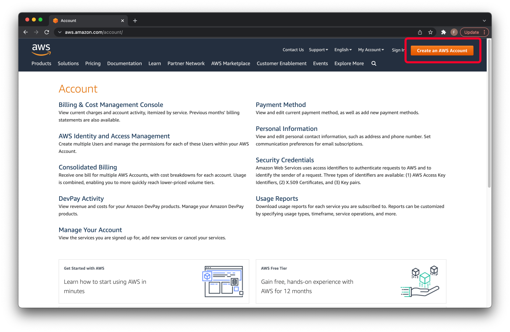
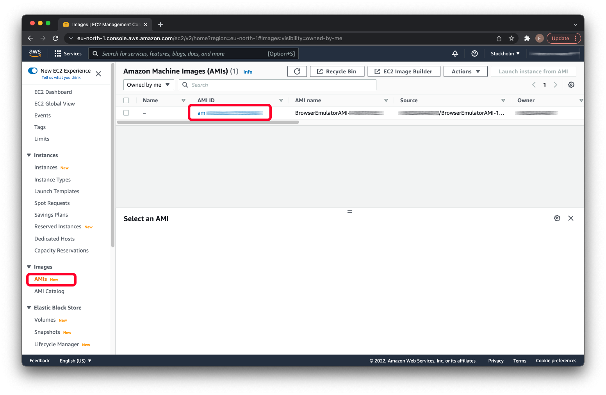

# How to setup and use OpenVidu Load Test on AWS

## AWS Root Account

In order to follow the instructions in this guide, **you need an account for Amazon AWS services**. If you don't have one, you can create it for free here:

https://aws.amazon.com/account/

Click *Create an AWS Account* button to begin. Then, follow the instructions. 



> This will be your **AWS root account**. For increased security, use it only for maintenance purposes. In the next step, you will create an IAM user for performing daily tasks via browser or console access.

Notice that:
* AWS Free Tier allows testing many AWS services without charges for the first 12-month period. Be careful, as not all services are free and usage above limits is also charged!
* You will need a credit or debit card for creating a new AWS account, even if you intend to use only what's included into the free trial.
* As of writing this, AWS Free Tier for Amazon EC2 includes 750 hours usage of Linux t1-t3.micro instances per month. Micro instances are pretty weak for OpenVidu Load Test purposes. You can instantiate multiple, but each instance will consume your 750 free hours.
* Any realistical load testing requires producing large amount of load/traffic. What is included in AWS Free Tier most likely will not suffice, so you should prepare for paying for AWS resource use.

Read more about AWS Free Tier quotas:
https://docs.aws.amazon.com/awsaccountbilling/latest/aboutv2/free-tier-limits.html

## IAM User Account & access keys

For increased security, create an IAM administrator user for yourself and add it to administrators group. First, log in to IAM console using your AWS root account:

https://console.aws.amazon.com/iam/ 

Then, follow instructions on this page from step 2 onwards to create an IAM user with administrator rights.

https://docs.aws.amazon.com/cli/latest/userguide/getting-started-prereqs.html

Tips:
* You can use for example *openvidu-loadtest* as the username for the IAM user.
* Select both *Access key - Programmatic access* and *Password - AWS Management Console access*. You will use access keys for AWS CLI (see next section) and password for browser-based use. Also consider setting up 2-factor authentication (2FA).
* Be sure to safely store your IAM username, access key ID and secret access key. You will need these in the next step. Notice that they will be shown **only once** when you create the account.

## AWS CLI

OpenVidu Load Test will create and start multiple AWS Elastic Cloud EC2 instances (=virtual machines that you rent from AWS), run load tests, and finally stop and destroy used resources. It uses *AWS Command Line Interface* (CLI) to do this. Therefore, you don't need to setup EC2 instances manually via the browser-based AWS Management Console. Instead, you must install and configure AWS CLI on the machine that you use for controlling load test runs.

### Installing AWS CLI

Follow the official instructions for installing AWS CLI to your console environment:

https://docs.aws.amazon.com/cli/latest/userguide/getting-started-install.html

For example, installing it on Mac OS is as simple as this:
```bash
$ curl "https://awscli.amazonaws.com/AWSCLIV2.pkg" -o "AWSCLIV2.pkg"
$ sudo installer -pkg AWSCLIV2.pkg -target /
```

When finished, check that it is working:
```bash
$ which aws
/usr/local/bin/aws
$ aws --version
aws-cli/2.5.2 Python/3.9.11 Darwin/20.6.0 exe/x86_64 prompt/off
```

### Configuring AWS CLI

AWS CLI needs your IAM administrator user's *access key ID* and *secret access key* for performing tasks using your account. It also needs to know your default AWS region. These are stored in a configuration file (~/.aws/credentials).

You can create a new configuration file as follows. Just answer the questions and it will be generated automatically.
```bash
$ aws configure
```

> The configuration file supports multiple profiles (accounts). If you already have AWS accounts, edit .aws/credentials and .aws/config files to add a new profile for your new openvidu-loadtest IAM user.

If you have configured multiple profiles, you should specify the name of the profile that will be used, for all AWS CLI commands (an alternative is to set a default profile). For example, this will list AWS S3 buckets that belong to the openvidu-loadtest AWS account:
```bash
$ aws s3 ls --profile openvidu-loadtest
```

More information:
https://docs.aws.amazon.com/cli/latest/userguide/getting-started-quickstart.html

## Preparing test client VM

Openvidu Load Test creates AWS EC2 instances that run simulated OpenVidu clients (browser-emulator) and thus produces test load for your Openvidu server installation.

AMI (Amazon Machine Image) is AWS's solution for providing the information required to launch an EC2 virtual machine instance. 

Thus, we need to create an AMI that defines what kind of EC2 virtual machines will be used for running your simulated clients.

### createAMI.sh script

1. Take a look at *openvidu-loadtest* repository and specifically *browser-emulator/aws/createAMI.sh* shell script. This script can be used for creating an AMI that is suitable for load testing.
2. Check the line that begins "export AWS_DEFAULT_REGION=". You may need to change the region, for example to *eu-north-1* or whatever is nearest to your OpenVidu server.
3. Check the line that begins "IMAGE_ID=". You may need to change the virtual machine image that will be used as a basis for your VM, as these are different for each region. Visit https://cloud-images.ubuntu.com/locator/ec2/ to find a specific AMI. For example, Ubuntu 20.04 LTS (amd) in eu-north-1 region would be *ami-028e617986049d65f*.
4. If you have multiple AWS profiles, either make sure that the correct one is set as the default profile or define a variable AWS_PROFILE and append this to all aws commands in the script: '--profile $AWS_PROFILE'.

### EC2-browser-emulator.yml script

The createAMI.sh shell script refers to a YAML script in the same directory: *EC2-browser-emulator.yml*. This script defines for example the size of the EC2 VM instance (which affects to the charges for your AWS account!) as well as the custom steps that are performed in initializing the VM, e.g. what software packages are installed and what scripts and video content are copied into the VM.

1. Take a look at *openvidu-loadtest* repository and specifically *browser-emulator/aws/EC2-browser-emulator.yml* script.
2. Check the line that begins "InstanceType:" By default, this is "t3.small". You may want to change it to a smaller or a larger one.
3. Check the line that begins "git clone https://github.com/OpenVidu/openvidu-loadtest.git". If you are using a forked repository, make sure to edit this so that the script will clone the repository whose configuration you want to use.

### browser-emulator/download_mediafiles.sh script

The YAML script refers to *./browser-emulator/prepare.sh* shell script. This will further prepare the VM for acting as virtual client for OpenVidu.

One of the tasks is to download audio/video files that will be used in place of real webcam feed. The files are downloaded from network in *browser-emulator/download_mediafiles.sh* shell script. 

If you need custom content files for your load tests, edit this script as well. For example, you may want to setup an AWS S3 bucket, upload a few test videos, and refer to these in download_mediafiles.sh script.

### Running the scripts

 Before running the scripts, make sure that the *jq* tool is installed. It is used in the scripts for querying data from AWS's json responses to AWS CLI commands. For example on MacOS:
 ```bash
 $ brew install jq
 ```

Once you are satisfied with the scripts mentioned above, run them all with a single command by calling the main script:

```bash
$ ./browser-emulator/aws/createAMI.sh
```

*This can take a while, say, 1-2 hours in total.*

Once the script completes successfully, it will print the ID of the AMI it created:
```bash
...

Creating AMI: ami-XXXXXXXXXXXXXXXXX
Cleaning up ...
Waiting to AMI available ...
Created AMI: ami-XXXXXXXXXXXXXXXXX
```

You can also log in to AWS Management Console, navigate to EC2, and under Images/AMIs you should find your new AMI listed. Notice that the same AMI ID that was printed on console is listed here.



### Configuring AMI ID

OpenVidu Load Test control application needs to know what is the ID of your AMI, so that it can spawn correct EC2 virtual machines.

1. Open load-test/src/main/resources/application.properties file for editing.

2. Find *WORKER_AMI_ID* property and replace its value (copy-paste) with your new AMI ID.

3. You may also need to edit *WORKER_INSTANCE_TYPE* property to set the desired VM size.

4. Save & exit.

## AWS Security Group

Before you can use your new AMI for spawning virtual machines, you need to setup a way for accessing it remotely over the network. OpenVidu Load Test controller application will communicate with each EC2 VM instance. Specifically, these two ports must be opened:

* Port 5000 for the REST API (control)
* Port 5001 for the WebSocket (results)

In AWS, ports are configured by creating an AWS Security Group (SG), which acts as a virtual firewall.

### Create a new security group

1. Log in to AWS Management Console.

2. Navigate to EC2 and select *Security Groups* under *Network & Security*.

3. Click *Create security group*.

4. Give name (e.g. "openvidu-loadtest") and description (e.g. "remote access from OpenVidu Load Test controller"). Choose the default VPC.

5. Add two inbound rules:
* Custom TCP, port 5000, Anywhere or My IP, "REST API".
* Custom TCP, port 5001, Anywhere or My IP, "WebSocket".

6. Click *Create security group*.

Security group will be created and listed. You can find its *Security group ID* from the list (you will need this value in the next step).

### Configuring security group ID

OpenVidu Load Test control application needs to know what is the ID of your security group.

1. Open load-test/src/main/resources/application.properties file for editing.

2. Find *WORKER_SECURITY_GROUP_ID* property and replace its value (copy-paste) with your new Security group ID.

3. You may also need to edit *WORKER_INSTANCE_REGION* property, this should of course match with the AWS region you are using.

4. Save & exit.

## More AWS Configuration

### Access keys

OpenVidu Load Test control application needs to know the access keys for your AWS account, so that it can perform AWS tasks such as spawn virtual machines.

1. Open load-test/src/main/resources/application.properties file for editing.

2. Find *AWS_ACCESS_KEY* property and replace its value (copy-paste) with your AWS access key ID.

3. Find *AWS_SECRET_ACCESS_KEY* property and replace its value (copy-paste) with your AWS secret access key.

4. Find *S3_BUCKET_NAME* property and replace its value with a unique bucket name of your choice. If you try to use the default one, an error will be shown during a test run, as OpenVidu Load Test tries to create the bucket and the default name is already reserved (AWS S3 bucket names are shared globally).

5. Save & exit.

> Tip: Check that property *WORKER_MAX_LOAD* is set to 90 or something clearly below 100. Browser estimation phase tends to fail with value 100, as measured CPU load may not reach 100% even when the VM is already on its knees under the load and stops responding in time.

## Testing

Now you are ready to run a load test by executing the controller as usual. Running and configuring tests is similar to using a local setup: you edit configuration files *application.properties* and *test_cases.json* to your liking, and then run the controller:

```bash
$ cd loadtest-controller
$ mvn spring-boot:run
```

Notice that initializing VMs in AWS takes a moment and thus the controller may flood the console with errors about failed pings. It can take a minute or two until a spawned VM in running, so be patient.

You can also log in to AWS Management Console, navigate to EC2, and under *Instances* select *Instances*. When a test is running, you should find one or more instances in the list. You can observe *Instance State* field here. 

> Auto-refresh does not seem to work perfectly, so you may want to update the view by clicking the refresh button from the AWS Management Console UI (not from the browser's toolbar).

## Cleanup

After failed or successful test, the controller should tear down the resources, including stopping and terminating the VM instances it has launched. Notice that terminating an instance seems to take several minutes. Once a VM has been stopped or terminated, it does not produce more charges on your AWS account. Terminated VMs will automatically disappear from the list within 1 hour, but not immediately after termination.

> If OpenVidu Load Test fails to terminate VMs automatically, you can stop them via AWS Management Console. Make sure to check this when you are done with testing, VMs left running will consume your Free Tier hours or worse, be charged from your AWS account!

You can also list VM instances and check their current state using AWS CLI:
```bash
$ aws ec2 describe-instances --profile openvidu-loadtest --query "Reservations[].Instances[].[InstanceId,State]"

[
    [
        "i-08a103169f3164s12",
        {
            "Code": 16,
            "Name": "running"
        }
    ]
]
```

